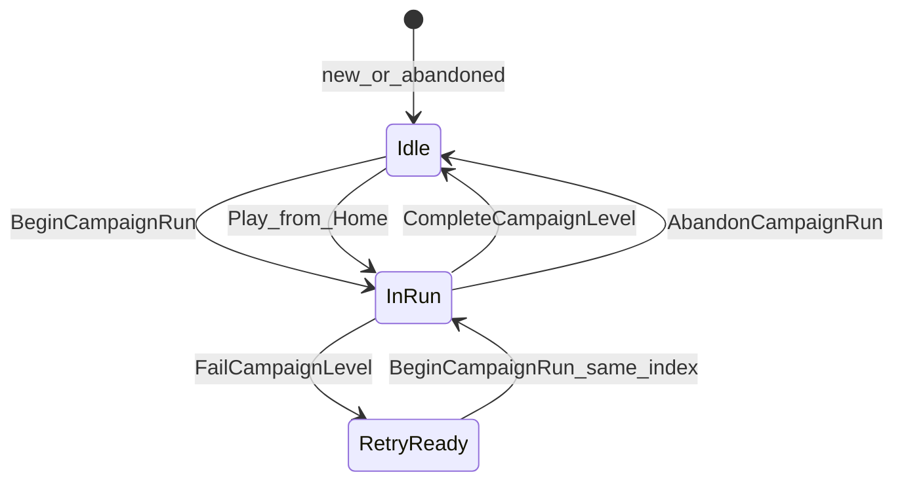

# NumStrata Save Spec (Locked)

> **Version:** 1  
> **Status:** Locked for implementation (Phase 1+)  
> **Plan:** [docs/LOCAL_SAVE_PLAN.md](../../../docs/LOCAL_SAVE_PLAN.md)  
> **I/O rules:** [SKILL.md](./SKILL.md)

Tài liệu này là **nguồn sự thật** cho schema local save và hành vi campaign. Agent và dev **không** thêm `campaignProgress[]` hoặc replay màn đã clear trừ khi product đổi spec.

---

## 1. Design principles

| Principle | Rule |
| --------- | ---- |
| Offline-first | Gameplay và UI meta đọc **local cache**; không cần mạng để chơi campaign. |
| Linear campaign | Một con trỏ tiến (`currentLevelIndex` / `currentLevelId`); **không** lưu danh sách mọi màn đã clear. |
| No replay | Sau `CompleteCampaignLevel()`, màn đó **không** load lại từ Home. |
| Fail / abandon (A) | Chưa clear → **không** tăng index; Play lại **cùng** `currentLevelId`. |
| Split files | Profile ≠ session resume; corrupt resume **không** xóa profile. |
| Milestone I/O | Không `FlushPlayerData()` trên hot path (mỗi gold, mỗi frame). |
| Resume phase 1 | **Ghi** `SessionResume.json` only; **không** restore board cho đến phase sau. |

---

## 2. File layout

Tất cả dưới `Application.persistentDataPath` (Unity Editor Windows ví dụ):

`%USERPROFILE%\AppData\LocalLow\DefaultCompany\NumStrata\`

| File | Purpose | Written when |
| ---- | ------- | ------------ |
| `PlayerData.json` | Hồ sơ + campaign pointer + economy | Milestone flush (see §5) |
| `PlayerData.bak` | Backup trước lần ghi profile thành công gần nhất | Trước mỗi `FlushPlayerData()` |
| `PlayerData.json.tmp` | Atomic write staging | During flush only |
| `SessionResume.json` | Trạng thái bàn giữa ván | Save khi bấm Home hoặc app pause/quit (see §6) |

**Không lưu trong profile:**

- Level JSON (`Resources/Campaign/campaign_XXXX`) — read-only content.
- Settings: `Language`, `SoundVolume`, `MusicVolume` → **PlayerPrefs** only.

**Ephemeral (không phải save):**

- `PlayerPrefs` key `PendingLevelId` (`CampaignSession.PendingLevelIdKey`) — truyền MainMenu → Gameplay một lần, xóa sau khi LevelLoader đọc.

---

## 3. Schema — `PlayerData` (saveVersion 1)

Root type serialized to `PlayerData.json`. `JsonUtility` — field names = JSON keys.

### 3.1 Envelope (bắt buộc trên root)

| Field | Type | Default | Notes |
| ----- | ---- | ------- | ----- |
| `saveVersion` | int | `1` | Tăng khi breaking schema; implement migration in `LocalDataManager`. |
| `lastModifiedAt` | long | unix UTC seconds | Cập nhật mỗi `MarkPlayerDirty()`; dùng cloud merge sau này. |
| `isDirtyCloud` | bool | false | `true` sau local change chưa sync; cloud phase 2+. |

### 3.2 Identity & meta

| Field | Type | Notes |
| ----- | ---- | ----- |
| `playerId` | string | UUID, tạo lần đầu, không đổi. |
| `displayName` | string | |
| `createdAt` | long | unix UTC |

### 3.3 Economy & streak

| Field | Type | Notes |
| ----- | ---- | ----- |
| `gold` | int | RAM + dirty; flush milestone. |
| `totalStreak` | int | Hiển thị Home header. |
| `streakIconId` | string | Optional; có thể derive từ `totalStreak` nếu trống. |
| `shield` | `PlayerShield` | Nested OK (nhỏ, ít ghi). |

`PlayerShield`: `hasShield`, `lastShieldConsumedAt`, `nextShieldRegenAt` (unix).

### 3.4 Campaign — linear pointer only (`CampaignSaveData`)

| Field | Type | Default (new player) | Notes |
| ----- | ---- | -------------------- | ----- |
| `currentLevelIndex` | int | `1` | **1-based**, khớp UI label "Level N". |
| `currentLevelId` | string | `"campaign_0001"` | Phải khớp `IndexToLevelId(currentLevelIndex)`. |
| `hasActiveRun` | bool | `false` | `true` khi đã `BeginCampaignRun` và chưa clear/fail/abandon flush. |

**Không có:** `campaignProgress[]`, `LevelProgress`, per-level `attempts` on client (analytics có thể gửi server riêng sau).

### 3.5 Level ID helpers (implement on `CampaignSession` or `CampaignProgressUtil`)

```
IndexToLevelId(index)   => $"campaign_{index:D4}"   // 1 -> campaign_0001
LevelIdToIndex(levelId) => parse trailing digits; 0 if invalid
```

Validation: `currentLevelId` must equal `IndexToLevelId(currentLevelIndex)` after every campaign mutation.

---

## 4. Schema — `SessionResume` (separate file)

Không nhúng vào `PlayerData.json`.

| Field | Type | Notes |
| ----- | ---- | ----- |
| `saveVersion` | int | Resume schema version (start at `1`). |
| `activeLevelId` | string | Must match `PlayerData.campaign.currentLevelId` when saved. |
| `levelHelperUses` | int | |
| `savedAt` | long | unix UTC when written |
| `tiles` | `List<TileSaveState>` | |

`TileSaveState` (flattened, match `LevelLoader.TriggerAutosave`):

| Field | Type |
| ----- | ---- |
| `location` | string: `"board"` \| `"formula"` \| `"conveyor"` |
| `gridX`, `gridY`, `layerId` | int |
| `slotIndex` | int (formula/conveyor) |
| `tileType` | string |
| `numberValue` | int |
| `operatorValue` | string |
| `isMystery` | bool |

**Phase 1 scope:** write only; `LoadSessionResume` + apply to board = **out of scope**.

---

## 5. Campaign state machine



### 5.1 Transitions (locked)

| Event | API | `currentLevelIndex` | `currentLevelId` | `hasActiveRun` | SessionResume |
| ----- | --- | ------------------- | ---------------- | -------------- | ------------- |
| New profile | `CreateDefaultPlayer` | `1` | `campaign_0001` | `false` | none |
| Level loaded (gameplay) | `BeginCampaignRun(levelId)` | unchanged | unchanged; **must match** arg | `true` | chưa ghi ngay |
| Board cleared (win) | `CompleteCampaignLevel()` | `++` | `IndexToLevelId(new index)` | `false` | **Delete** |
| Fail (lose) | `FailCampaignLevel()` | unchanged | unchanged | `false` | **Delete** |
| Pause → Home | `SaveSessionResumeNow()` | unchanged | unchanged | unchanged | **Save/Update** |
| App pause / quit | `FlushPlayerData()` + `SaveSessionResumeNow()` nếu level active | — | — | — | **Save/Update** |

### 5.2 Play from Home

1. `levelId = GetCurrentLevelId()` (= `campaign.currentLevelId`).
2. `PlayerPrefs.SetString(PendingLevelIdKey, levelId)`.
3. Load scene Gameplay.
4. `LevelLoader` resolves `Resources.Load("Campaign/" + levelId)`.
5. On load complete → `BeginCampaignRun(levelId)`.

**Không** load `campaign_{index-1}` after clear.

### 5.3 Fail rule A (explicit)

- Thua = **không** advance index.
- Xóa resume → lần Play sau spawn board **mới** cùng màn (không restore tiles phase 1).
- Không coi fail là “replay màn cũ đã hoàn thành”.

---

## 6. Flush & dirty rules

### 6.1 Player profile

| Action | RAM | Disk |
| ------ | --- | ---- |
| `MarkPlayerDirty()` | `lastModifiedAt = UtcNow`, `isDirtyCloud = true` | — |
| `FlushPlayerData()` | — | Atomic write `PlayerData.json` + rotate `.bak` |
| `AddGold`, `UseShield`, … | mutate + `MarkPlayerDirty()` | **no** immediate flush |

**Must call `FlushPlayerData()`:**

- First profile creation
- `BeginCampaignRun`, `CompleteCampaignLevel`, `FailCampaignLevel`, `AbandonCampaignRun`
- `OnApplicationPause(true)`
- `OnApplicationQuit`

**Must NOT call `FlushPlayerData()`:**

- `Update()` / per-frame
- Each small gold tick in gameplay loop
- Opening Home menu (read RAM only)

`SaveData()` (legacy) → alias `FlushPlayerData()` until call sites migrated.

### 6.2 Session resume

| Action | Disk |
| ------ | ---- |
| `SaveSessionResumeNow()` from `LevelLoader` | Write `SessionResume.json` (compact JSON) |
| On Home | Save before scene change |
| On app lifecycle | Save at `OnApplicationPause(true)` and `OnApplicationQuit` |

**Must NOT:** save resume every frame, timer loop, hoặc mỗi tile click.

---

## 7. Serialization & integrity

| Topic | Rule |
| ----- | ---- |
| Format | `JsonUtility` for MVP |
| Pretty print | `false` in release; `true` only in `DEVELOPMENT_BUILD` if needed |
| Atomic profile write | Write `PlayerData.json.tmp` → replace `PlayerData.json`; copy previous to `.bak` |
| Anti-cheat MVP | Plain JSON acceptable for soft-launch; plan encode+hash (level B) before IAP — see [SKILL.md](./SKILL.md) |
| Cloud prep | Always maintain `lastModifiedAt` + `isDirtyCloud` on profile |

---

## 8. Corrupt / missing file handling

| Case | Behavior |
| ---- | -------- |
| `PlayerData.json` missing | Create default profile (§5.1 new profile), `FlushPlayerData()` |
| `PlayerData.json` parse error | Try `PlayerData.bak`; if fail → new default profile + log error |
| `SessionResume.json` parse error | Delete resume file; **do not** modify profile |
| Resume `activeLevelId` ≠ current `currentLevelId` | Delete resume (stale); log warning |
| Invalid `currentLevelIndex` (\< 1) | Clamp to `1` + fix `currentLevelId` on load migration |

---

## 9. Migration

| From | To | Action |
| ---- | -- | ------ |
| No `saveVersion` (legacy file) | `saveVersion = 1` | If missing `campaign` block: set index=1, id=`campaign_0001`, `hasActiveRun=false` |
| Old `campaignProgress[]` (if ever shipped) | v1 linear | `currentLevelIndex = max(cleared indices) + 1`, or `1`; drop list |

Implement in `LocalDataManager.LoadData()` after deserialize.

---

## 10. Settings (PlayerPrefs keys)

| Key | Type | Default |
| --- | ---- | ------- |
| `Language` | string | `"vi"` |
| `SoundVolume` | float | `1.0` |
| `MusicVolume` | float | `1.0` |

Access via `LocalDataManager` properties only — not in `PlayerData.json`.

---

## 11. Cloud sync (future — do not implement in Phase 1–4)

When adding Firestore:

- UI reads local `CurrentPlayer` only.
- Sync on timer (30–60s) or milestone if `isDirtyCloud`.
- Merge: `lastModifiedAt` vs cloud timestamp (see SKILL Part 2).
- Spends: `TransactionID` (UUID) idempotent.

---

## 12. Implementation checklist (agent)

Before marking save work complete:

- [ ] Schema matches §3–§4
- [ ] No `campaignProgress[]`
- [ ] Campaign API matches §5
- [ ] Flush table matches §6
- [ ] Corrupt handling matches §8
- [ ] `HomeUIManager` uses `GetCurrentLevelIndex()` / `GetCurrentLevelId()` only
- [ ] `LevelLoader` uses `BeginCampaignRun` not `UpdateLevelState`
- [ ] Resume save only on Home/pause/quit; no board restore unless spec updated
- [ ] Grep `SaveData(` — every caller is milestone-safe

---

## Changelog

| Date | Version | Change |
| ---- | ------- | ------ |
| 2026-05-27 | 1 | Initial locked spec (Phase 0) |
