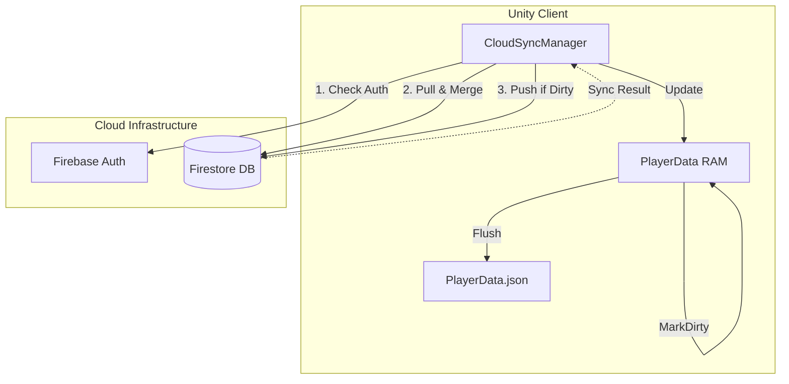

# Kế hoạch phát triển Cloud Save — NumStrata

> **Trạng thái:** Dự thảo (Draft) — Sẵn sàng cho Phase 5  
> **Cập nhật:** 2026-06-03  
> **Liên quan:** [LOCAL_SAVE_PLAN.md](./LOCAL_SAVE_PLAN.md), [numstrata-player-data.instructions.md](../.github/instructions/numstrata-player-data.instructions.md)

## Tổng quan

Triển khai hệ thống đồng bộ đám mây dựa trên **Firebase Firestore**. Mục tiêu: Bảo vệ tiến trình người chơi, hỗ trợ chơi đa thiết bị và chống gian lận (anti-cheat) cơ bản. Hệ thống hoạt động theo mô hình **Local-first, Delayed-sync**.

---

## Bối cảnh & quyết định đã chốt

| Quyết định | Giá trị |
| ---------- | ------- |
| **Nhà cung cấp** | **Firebase Firestore** (Phù hợp với GDD) |
| **Xác thực** | **Firebase Auth** (Anonymous mặc định) |
| **Cơ chế Sync** | **Dirty Flag** (Dựa trên `isDirtyCloud` đã có trong PlayerData) |
| **Xử lý xung đột** | **Timestamp-based** (Bản save có `lastModifiedAt` lớn nhất sẽ thắng) |
| **Tần suất Sync** | StartGame (Pull), EndLevel/BackHome (Push), OnReconnect |

---

## Sơ đồ luồng dữ liệu (Cloud Sync)

---

## Các thành phần cần triển khai

### 1. CloudSyncManager.cs (Mới)
- Quản lý trạng thái kết nối Cloud.
- Hàm `SyncWithCloud()`: Chạy khi Start Game.
- Hàm `PushToCloud()`: Chạy khi `isDirtyCloud == true`.
- Logic `Merge(local, remote)`: So sánh `lastModifiedAt`.

### 2. Cập nhật LocalDataManager.cs
- Hiện tại đã có `MarkPlayerDirty()` và `isDirtyCloud`. Cần bổ sung Event `OnSyncCompleted` để UI cập nhật khi data từ mây về.

---

## Checklist triển khai

- [ ] **firebase-integration** — Tích hợp Firebase SDK (Auth, Firestore).
- [ ] **sync-logic** — Viết `CloudSyncManager` xử lý Pull/Push/Merge.
- [ ] **auth-flow** — Triển khai Silent Anonymous Auth.
- [ ] **qa-cloud** — QA theo [CLOUD_SAVE_TEST_CASES.md](./CLOUD_SAVE_TEST_CASES.md).
