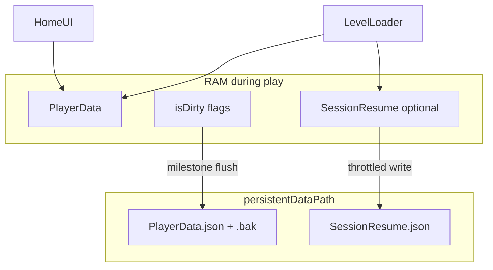

# Kế hoạch phát triển Save Local — NumStrata

> **Trạng thái:** Phase 0–4 đã triển khai — QA thủ công theo [LOCAL_SAVE_TEST_CASES.md](./LOCAL_SAVE_TEST_CASES.md)
> **Cập nhật:** 2026-05-27
> **Liên quan:** [Skill.md](../Skill.md), [.cursor/skills/numstrata-storage-io/SKILL.md](../.cursor/skills/numstrata-storage-io/SKILL.md)

## Tổng quan

Refactor local persistence: offline-first, campaign tuyến tính (không replay), thua/abandon = retry cùng màn (A), flush profile theo milestone, `SessionResume` chỉ ghi khi người chơi về Home hoặc app pause/quit. **Chưa restore board** từ resume trong đợt này.

---

## Bối cảnh & quyết định đã chốt

| Quyết định                | Giá trị                                                                                                        |
| ---------------------------- | ---------------------------------------------------------------------------------------------------------------- |
| Offline                      | Có — local authoritative cho gameplay                                                                          |
| Campaign                     | **Một chiều**, không chơi lại màn đã clear                                                         |
| Progress model               | **Chỉ con trỏ tuyến tính** (`currentLevelIndex` + `currentLevelId`), không `campaignProgress[]` |
| Thua / abandon (chưa clear) | **A** — giữ nguyên index, retry **cùng màn**                                                    |
| SessionResume                | File riêng; chỉ ghi khi về Home hoặc app pause/quit; chưa restore board                                     |
| Settings                     | `PlayerPrefs` (language, volume)                                                                               |
| I/O style                    | `MarkDirty` + flush milestone; JSON compact + `saveVersion`; backup `.bak` (MVP integrity)                 |

---

## Hiện trạng code (cần sửa)

- [LocalDataManager.cs](../Assets/_Game/Scripts/Data/LocalDataManager.cs): chỉ profile tối giản; `SaveData()` sync mỗi lần `AddGold`/`UseShield` — **trái skill**.
- [HomeUIManager.cs](../Assets/_Game/Scripts/UI/HomeUIManager.cs): dùng `campaignProgress` / `LevelProgress` — **không tồn tại**, sẽ không compile.
- [LevelLoader.cs](../Assets/_Game/Scripts/Gameplay/LevelLoader.cs): gọi `UpdateLevelState`, `SaveSessionResume`, `offlinePlayCount` — **không tồn tại**; `TriggerAutosave()` có logic ghi nhưng thiếu type `SessionResume` / `TileSaveState`.
- Skill: cần bổ sung spec locked trong `.cursor/skills/numstrata-storage-io/reference.md`.



---

## Checklist triển khai

- [X] **spec-reference** — [.cursor/skills/numstrata-storage-io/reference.md](../.cursor/skills/numstrata-storage-io/reference.md)
- [X] **player-save-models** — [PlayerSaveModels.cs](../Assets/_Game/Scripts/Data/PlayerSaveModels.cs)
- [X] **local-data-manager** — [LocalDataManager.cs](../Assets/_Game/Scripts/Data/LocalDataManager.cs)
- [X] **home-ui** — [HomeUIManager.cs](../Assets/_Game/Scripts/UI/HomeUIManager.cs)
- [X] **level-loader-hooks** — [LevelLoader.cs](../Assets/_Game/Scripts/Gameplay/LevelLoader.cs), [CampaignSaveHooks.cs](../Assets/_Game/Scripts/Gameplay/CampaignSaveHooks.cs)
- [X] **pause-abandon** — [PauseManager.cs](../Assets/_Game/Scripts/UI/PauseManager.cs)
- [X] **qa-offline** — QA thủ công: [LOCAL_SAVE_TEST_CASES.md](./LOCAL_SAVE_TEST_CASES.md)

---

## Phase 0 — Spec & skill (0.5 ngày)

Tạo [.cursor/skills/numstrata-storage-io/reference.md](../.cursor/skills/numstrata-storage-io/reference.md) ghi **NumStrata Save Spec (locked)**:

- Schema `PlayerData` + `CampaignSaveData` (linear pointer)
- Milestone bảng flush profile vs resume
- Quy tắc clear / fail / abandon / start run
- Đường dẫn file, `saveVersion`, xử lý corrupt

---

## Phase 1 — Data models & file layout (1 ngày)

**File mới:** [Assets/_Game/Scripts/Data/PlayerSaveModels.cs](../Assets/_Game/Scripts/Data/PlayerSaveModels.cs)

```csharp
// Root envelope
saveVersion, lastModifiedAt, isDirtyCloud (prep)

// CampaignSaveData — linear only
currentLevelIndex      // 1-based, khớp UI "Level N"
currentLevelId         // "campaign_0004"
hasActiveRun           // đang có ván dở trên màn hiện tại

// SessionResume + TileSaveState (flattened fields như LevelLoader đang build)
```

**Helpers tĩnh** trên `CampaignSession` hoặc `CampaignProgressUtil`:

- `IndexToLevelId(int index)` → `campaign_{index:D4}`
- `LevelIdToIndex(string id)` → parse số cuối

**Không** thêm `List<LevelProgress>`.

---

## Phase 2 — `LocalDataManager` refactor (2–3 ngày)

### 2a. Load / save pipeline

- `PlayerSaveFilePath`, `SessionResumeFilePath` (public getters)
- `LoadData()` / `SavePlayerData()` với:
  - `saveVersion` migration (v0 → v1: init campaign index = 1, id = `campaign_0001`)
  - Ghi **atomic**: write `*.tmp` → copy/replace; giữ `PlayerData.bak` trước khi ghi
  - JSON **compact** (`JsonUtility.ToJson(obj, false)`)
- `LoadSessionResume()` / `SaveSessionResume()` — file riêng; corrupt resume → xóa file, **không** đụng profile

### 2b. Dirty + milestone (theo skill)

| API                        | Hành vi RAM                                      | Flush disk                                       |
| -------------------------- | ------------------------------------------------- | ------------------------------------------------ |
| `MarkPlayerDirty()`      | `lastModifiedAt = now`, `isDirtyCloud = true` | —                                               |
| `FlushPlayerData()`      | —                                                | Ghi `PlayerData.json`                          |
| `AddGold`, `UseShield` | Cập nhật RAM +`MarkPlayerDirty()`             | **Không** gọi `SaveData()` trực tiếp |

**Milestone gọi `FlushPlayerData()`:**

- `OnApplicationPause(true)` / `OnApplicationQuit`
- Campaign: `OnLevelStarted`, `OnLevelCleared`, `OnLevelFailed`, `OnLevelAbandoned`
- Tạo profile mới (lần đầu)

### 2c. Campaign API (thay `UpdateLevelState`)

| Method                                               | Logic (linear + rule A)                                                                                            |
| ---------------------------------------------------- | ------------------------------------------------------------------------------------------------------------------ |
| `GetCurrentLevelIndex()` / `GetCurrentLevelId()` | Đọc từ `CampaignSaveData`                                                                                     |
| `BeginCampaignRun(string levelId)`                 | Validate `levelId` == current; `hasActiveRun = true`; flush                                                    |
| `CompleteCampaignLevel()`                          | `currentLevelIndex++`; cập nhật `currentLevelId`; `hasActiveRun = false`; `DeleteSessionResume()`; flush |
| `FailCampaignLevel()`                              | **Không** tăng index; mặc định `hasActiveRun = false` + xóa resume; flush                            |
| `AbandonCampaignRun()`                             | Không tăng index;`hasActiveRun = false`; `DeleteSessionResume()`; flush                                      |

**Chuẩn hóa `hasActiveRun`:** Play từ Home → load **cùng** `currentLevelId` (abandon đã xóa resume = board mới khi vào gameplay).

### 2d. Settings (`PlayerPrefs`)

- `Language`, `SoundVolume`, `MusicVolume` — đọc/ghi `PlayerPrefs`, **không** trong `PlayerData.json`

### 2e. Deprecation

- `SaveData()` → gọi `FlushPlayerData()` (giữ tạm cho call sites cũ)

---

## Phase 3 — Tích hợp UI & scene flow (1 ngày)

### HomeUIManager

- Xóa logic `campaignProgress` / `LevelProgress` / regex scan list
- `GetCurrentCampaignLevelNumber()` → `LocalDataManager.GetCurrentLevelIndex()`
- `GetActiveLevelId()` → `GetCurrentLevelId()`
- Play: `CampaignSession.PendingLevelId` + `BeginCampaignRun` từ LevelLoader

### Scene bootstrap

- **MainMenu** có `LocalDataManager` (DontDestroyOnLoad)

---

## Phase 4 — Tích hợp gameplay (1–2 ngày)

### LevelLoader

**Thay block sau load level (~L244–249):**

```csharp
// Cũ: UpdateLevelState(id, "in_progress", ...)
LocalDataManager.Instance.BeginCampaignRun(GetCurrentLevelId());
```

**Save session resume (ghi only):**

- `SaveSessionResumeNow()` khi bấm Home (PauseManager.GoToHome)
- `SaveSessionResumeNow()` ở `OnApplicationPause(true)` và `OnApplicationQuit` trong `LevelLoader`
- Không ghi theo timer trong gameplay loop

**Win / fail / abandon hooks:**

| Sự kiện         | Nơi gắn gợi ý                                                  | Save action                         |
| ----------------- | ------------------------------------------------------------------ | ----------------------------------- |
| Board cleared     | Sau cập nhật tile count                                          | `CompleteCampaignLevel()` + flush |
| Fail (tạm thời) | Sau cập nhật tile count: remaining `<4` và helper left `=0` | `FailCampaignLevel()` + flush     |
| Abandon           | PauseManager.GoToHome()                                            | `AbandonCampaignRun()` + flush    |

**Không** implement `LoadSessionResume` restore board trong phase này.

---

## Phase 5 — Kiểm thử & QA

1. **Tân thủ:** không file → index=1, id=`campaign_0001`
2. **Clear màn 1:** index=2, resume xóa, không quay lại `campaign_0001`
3. **Fail / abandon màn 2:** index vẫn 2; Play lại `campaign_0002`
4. **Pause giữa ván:** profile flush; `SessionResume.json` tồn tại
5. **Corrupt resume:** xóa resume, gold/index giữ nguyên
6. **AddGold nhiều lần:** không ghi disk đến milestone
7. **Offline:** campaign vẫn chơi và lưu local

Debug path: `LocalDataManager.Instance.PlayerSaveFilePath`

---

## Phase sau (ngoài scope)

- Restore board từ `SessionResume`
- Async write nếu cần
- Cloud sync (`isDirtyCloud`, timestamp merge, idempotent TX)
- Anti-cheat mức B khi có IAP

---

## Thứ tự triển khai

1. Phase 0 spec → Phase 1 models
2. Phase 2 LocalDataManager
3. Phase 3 HomeUIManager
4. Phase 4 LevelLoader + PauseManager
5. Phase 5 QA

Ưu tiên **sửa lỗi compile / API lệch** trước khi thêm feature mới.
