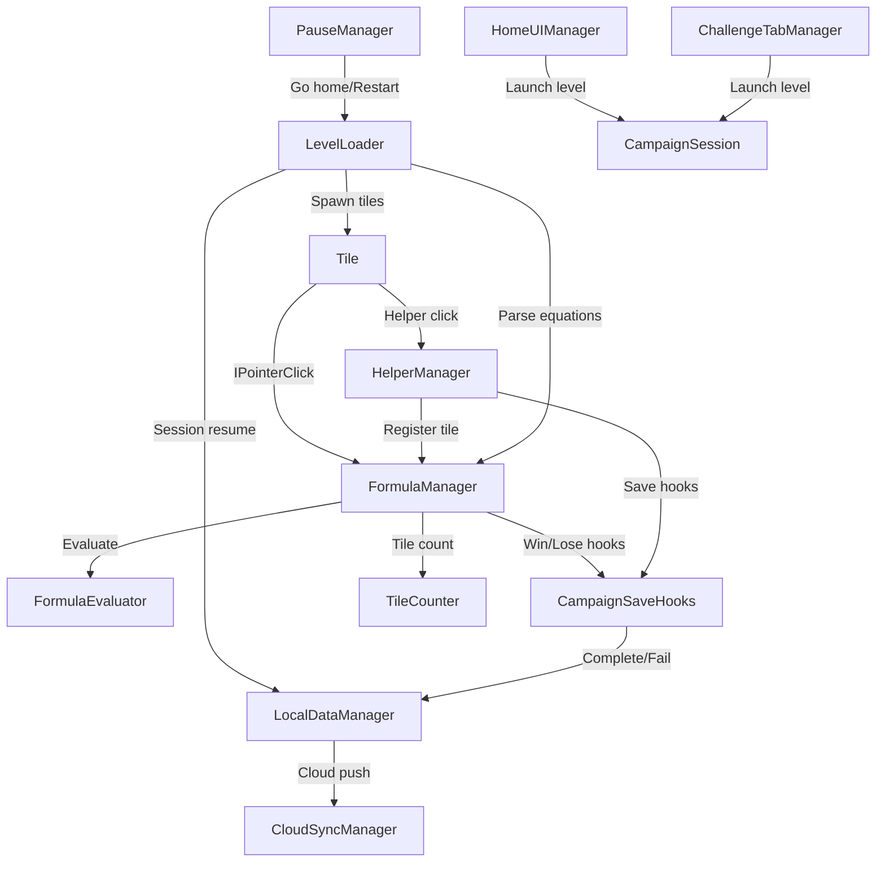
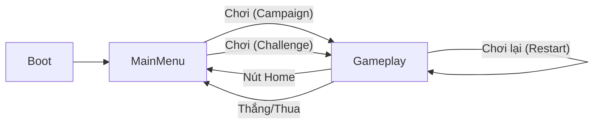

# NumStrata — Báo cáo Kiểm tra Toàn diện Dự án (Full Production Audit Report)

> **Vai trò**: Giám đốc Kỹ thuật Game Cấp cao / Trưởng nhóm QA / Kiến trúc sư Hệ thống (Senior Game Technical Director / QA Lead / System Architect)
> **Phạm vi**: 100% mã nguồn trong thư mục `Assets/_Game/Scripts`, dữ liệu màn chơi (level data), cấu trúc tài nguyên (resource structure), và mức độ tuân thủ tài liệu thiết kế GDD
> **Số lượng file đã kiểm tra**: 27 scripts + 1 GDD + các file level JSON + cấu trúc thư mục

---

## Mục lục

1. [Kiến trúc Dự án](#1-kiến-trúc-dự-án)
2. [Hệ thống Gameplay](#2-hệ-thống-gameplay)
3. [Quản lý Dữ liệu &amp; Lưu trữ](#3-quản-lý-dữ-liệu--lưu-trữ)
4. [Hệ thống UI / UX](#4-hệ-thống-ui--ux)
5. [Kinh tế &amp; Thương mại hóa](#5-kinh-tế--thương-mại-hóa)
6. [Âm thanh](#6-âm-thanh)
7. [Hiệu năng](#7-hiệu-năng)
8. [Vấn đề đặc thù trong Unity](#8-vấn-đề-đặc-thù-trong-unity)
9. [Chất lượng Code &amp; Khả năng Bảo trì](#9-chất-lượng-code--khả-năng-bảo-trì)
10. [Kiểm thử &amp; Đảm bảo Chất lượng (QA)](#10-kiểm-thử--đảm-bảo-chất-lượng-qa)
11. [Giai đoạn 2 — Danh sách Tính năng còn thiếu](#11-giai-đoạn-2--danh-sách-tính-năng-còn-thiếu)
12. [Giai đoạn 3 — Danh sách Quyết định (Checklist)](#12-giai-đoạn-3--danh-sách-quyết-định-checklist)

---

## 1. Kiến trúc Dự án (Project Architecture)

### 1.1 Cấu trúc Thư mục — ✅ Tốt

```
Assets/_Game/
├── Animation/
├── Art/
├── Data/           (ScriptableObject assets)
├── Levels/
├── Prefabs/        (Layer, Tiles, UI)
├── Resources/      (Campaign/, Streak/)
├── Scenes/         (Boot, Gameplay, MainMenu, MainMenuOld, SampleScene)
├── Scripts/
│   ├── Data/       (LocalDataManager, CloudSync, PlayerSaveModels, CampaignSession, TileSpriteData, DebugGoldButton)
│   ├── Editor/     (LevelEditorWindow)
│   ├── Gameplay/   (Tile, FormulaManager, LevelLoader, HelperManager, CampaignSaveHooks, etc.)
│   ├── UI/         (PauseManager, HomeUI, ChallengeTab, Ranking, SafeArea, etc.)
│   └── Utils/      (UIEffectManager, SpriteShadow2D, UIShadowImageBlur)
└── Shaders/        (UIShadowBlur, UI_BackgroundBlur)
```

**Nhận xét**: Phân chia rõ ràng theo domain/lĩnh vực (Data, Gameplay, UI, Utils, Editor). Tuân thủ đúng quy chuẩn của Unity.

### 1.2 Namespaces (Không gian tên) — ⚠️ Không đồng nhất

| Script                                                                                                     | Namespace                                                                         | Vấn đề           |
| ---------------------------------------------------------------------------------------------------------- | --------------------------------------------------------------------------------- | ------------------- |
| [MainMenuTabManager.cs](file:///c:/Project%20Unity/NumStrata/Assets/_Game/Scripts/UI/MainMenuTabManager.cs)   | **(none)**                                                                  | ❌ Global namespace |
| [UISwitchManager.cs](file:///c:/Project%20Unity/NumStrata/Assets/_Game/Scripts/UI/UISwitchManager.cs)         | **(none)**                                                                  | ❌ Global namespace |
| [TextSizeUniformizer.cs](file:///c:/Project%20Unity/NumStrata/Assets/_Game/Scripts/UI/TextSizeUniformizer.cs) | **(none)**                                                                  | ❌ Global namespace |
| [DebugGoldButton.cs](file:///c:/Project%20Unity/NumStrata/Assets/_Game/Scripts/Data/DebugGoldButton.cs)       | **(none)**                                                                  | ❌ Global namespace |
| Hầu hết các script khác                                                                                | `NumStrata.Gameplay`, `NumStrata.Data`, `NumStrata.UI`, `NumStrata.Utils` | ✅                  |

> [!WARNING]
> Có 4 script đang nằm ở global namespace (không gian tên chung). Trong một dự án production, điều này có nguy cơ gây xung đột tên gọi (name collision) với các SDK bên thứ ba.

### 1.3 Singleton Pattern — ⚠️ Lạm dụng, Không đồng nhất

**Phát hiện 9 singletons:**

| Singleton            | `DontDestroyOnLoad`? | Hành vi khi bị trùng                                                  |
| -------------------- | :--------------------: | ------------------------------------------------------------------------ |
| `LevelLoader`      |       ❌ Không       | `Destroy(gameObject)`                                                  |
| `FormulaManager`   |       ❌ Không       | `Destroy(gameObject)`                                                  |
| `FormulaEvaluator` |       ❌ Không       | `Destroy(gameObject)`                                                  |
| `HelperManager`    |       ❌ Không       | `Destroy(gameObject)`                                                  |
| `TileCounter`      |       ❌ Không       | `Destroy(gameObject)`                                                  |
| `PauseManager`     |       ❌ Không       | `Destroy(gameObject)`                                                  |
| `UIEffectManager`  |       ❌ Không       | `Destroy(gameObject)`                                                  |
| `LocalDataManager` |         ✅ Có         | `Destroy(this)` — **chỉ hủy script, không hủy Game Object** |
| `CloudSyncManager` |         ✅ Có         | `Destroy(gameObject)`                                                  |

> [!IMPORTANT]
> `LocalDataManager.Awake()` sử dụng `Destroy(this)` thay vì `Destroy(gameObject)`. Điều này là cố ý (theo comment trong code: "nó có thể chứa các UI script khác như GameManager") nhưng nó đồng nghĩa với việc các script mồ côi (orphan scripts) có thể tồn tại trên Game Object. Sự phụ thuộc (coupling) này nên được ghi chép lại hoặc tái cấu trúc (refactoring).

### 1.4 Sự Phụ thuộc & Liên kết (Coupling & Dependencies)



> [!WARNING]
> **Liên kết chặt chẽ (Tight coupling)**: `Tile.OnPointerClick()` trực tiếp tham chiếu đến `FormulaManager.Instance`, `HelperManager.Instance`, và `UIEffectManager.Instance`. Việc sử dụng một cơ chế phân tách (decoupling) duy nhất (ví dụ: Event Bus hoặc các delegate `Action`) sẽ cải thiện khả năng viết unit test.

### 1.5 Code Thừa / Code Chết (Obsolete / Dead Code)

| File                                                                                                       | Vấn đề                                                                                                                                     |
| ---------------------------------------------------------------------------------------------------------- | --------------------------------------------------------------------------------------------------------------------------------------------- |
| [SampleScene.unity](file:///c:/Project%20Unity/NumStrata/Assets/_Game/Scenes/SampleScene.unity)               | Scene mặc định — dường như không sử dụng                                                                                            |
| [MainMenuOld.unity](file:///c:/Project%20Unity/NumStrata/Assets/_Game/Scenes/MainMenuOld.unity)               | Scene cũ (legacy scene) — nên xóa trước khi đóng gói (shipping)                                                                      |
| [BoardLayerSystem.cs](file:///c:/Project%20Unity/NumStrata/Assets/_Game/Scripts/Gameplay/BoardLayerSystem.cs) | Tồn tại nhưng `LevelLoader` lại nhân bản logic sinh ô (spawning board) — không rõ script nào có thẩm quyền chính             |
| Trường `PlayerData.campaignProgress`                                                                   | Chỉ được sử dụng trong quá trình di chuyển dữ liệu v0→v1; hiện tại vẫn được tuần tự hóa (serialize) trong mỗi file save |

---

## 2. Gameplay Systems (Hệ thống Gameplay)

### 2.1 Cơ chế Giải đố Cốt lõi — ✅ Ổn định (Solid)

| Hệ thống                                     | Trạng thái | Ghi chú                                                                                                                                                                                      |
| ---------------------------------------------- | ------------ | --------------------------------------------------------------------------------------------------------------------------------------------------------------------------------------------- |
| Vòng đời ô số (spawn → click → formula) | ✅           | [Tile.cs](file:///c:/Project%20Unity/NumStrata/Assets/_Game/Scripts/Gameplay/Tile.cs): `OnPointerClick` xử lý các luồng board, trợ giúp (helper), và xóa                               |
| Đánh giá công thức (a OP b = result)      | ✅           | [FormulaEvaluator.cs](file:///c:/Project%20Unity/NumStrata/Assets/_Game/Scripts/Gameplay/FormulaEvaluator.cs): Triển khai mã hóa hai chữ số có dấu theo GDD 2.4                           |
| Cây đè lớp (covering/covered tiles)        | ✅           | [LevelLoader.cs L519-557](file:///c:/Project%20Unity/NumStrata/Assets/_Game/Scripts/Gameplay/LevelLoader.cs#L519-L557): `GenerateOverlapTree` với trạng thái khóa trực quan (visual lock) |
| Hệ thống băng chuyền (visual queue)        | ✅           | [FormulaManager.cs](file:///c:/Project%20Unity/NumStrata/Assets/_Game/Scripts/Gameplay/FormulaManager.cs): Coroutine `ProcessVisualQueue`                                                      |
| Sinh ô số dư (Remainder tile spawning)      | ✅           | Số dư phép chia được tách thành các ô số và đưa lên băng chuyền                                                                                                              |
| Hệ thống che ô bí ẩn (Mystery mask)       | ✅           | Áp dụng mặt nạ ngẫu nhiên với số lượng có thể cấu hình theo từng level                                                                                                         |

### 2.2 Điều kiện Thắng/Thua — ⚠️ Dễ lỗi (Fragile)

**Điều kiện thắng** ([CampaignSaveHooks.cs L20-28](file:///c:/Project%20Unity/NumStrata/Assets/_Game/Scripts/Gameplay/CampaignSaveHooks.cs#L20-L28)):

```
remainingTiles == 0 → THẮNG (WIN)
```

✅ Đúng theo GDD.

**Điều kiện thua** ([CampaignSaveHooks.cs L37-43](file:///c:/Project%20Unity/NumStrata/Assets/_Game/Scripts/Gameplay/CampaignSaveHooks.cs#L37-L43)):

```
remainingTiles < 4 && helperUsesLeft <= 0 → THUA (LOSE)
```

> [!CAUTION]
> **Vấn đề Nghiêm trọng**: Điều kiện thua được đánh dấu là `"temporary rule"` (quy tắc tạm thời) trong chú thích code. Ngưỡng `< 4` là hoàn toàn cảm tính. Theo GDD, điều kiện thua thực tế phải là: "Không còn nước đi hợp lệ NÀO KHÁC VÀ tất cả các công cụ trợ giúp đã được dùng hết." Quy tắc hiện tại có thể kích hoạt trạng thái Thua sai khi người chơi vẫn còn nước đi hợp lệ nhưng số ô trên bàn ít hơn 4.

### 2.3 Tiến trình Level & Luồng Mở khóa — ✅ Hoạt động bình thường

- Các level chiến dịch (Campaign) chạy tuần tự (`campaign_0001`, `campaign_0002`, …)
- [CampaignSession.cs](file:///c:/Project%20Unity/NumStrata/Assets/_Game/Scripts/Data/CampaignSession.cs) chuyển đổi giữa chỉ mục (index) và ID level
- Khi hoàn thành, `currentLevelIndex++` trong [LocalDataManager.CompleteCampaignLevel()](file:///c:/Project%20Unity/NumStrata/Assets/_Game/Scripts/Data/LocalDataManager.cs#L359-L422)

> [!WARNING]
> **Chỉ có 4 level chiến dịch tồn tại** (`campaign_0001` đến `campaign_0004`). Chưa có cơ chế xử lý khi hết nội dung — nếu người chơi vượt qua level 4 và bấm Play, `Resources.Load("Campaign/campaign_0005")` sẽ trả về null, và game sẽ tự động fallback tải lại `campaign_0001`. Đây là lỗi suy thoái ngầm (silent regression), không phải là cơ chế lặp cố ý.

### 2.4 Bộ Giải thuật Sinh Thông minh (Smart Spawn Solver) — ⚠️ Rủi ro Hiệu năng

[LevelLoader.cs L629-651](file:///c:/Project%20Unity/NumStrata/Assets/_Game/Scripts/Gameplay/LevelLoader.cs#L629-L651):

- Sử dụng **thuật toán quay lui vét cạn (brute-force backtracking)** với tối đa **300 lượt thử ngẫu nhiên**
- Mỗi lượt thử thực hiện đệ quy `SearchEquation → SearchToken` kết hợp kiểm tra mô phỏng cây đè lớp
- Thuật toán này chạy **đồng bộ trên main thread** trong hàm `Start()`

> [!CAUTION]
> Với các bố cục màn chơi phức tạp (nhiều lớp, nhiều phương trình), bộ giải này có thể gây đóng băng game trong **vài giây** khi đang load level. Không hề có màn hình chờ (loading screen), thanh tiến trình (progress bar) hay cơ chế fallback bất đồng bộ (async fallback). Trên các thiết bị di động cấu hình thấp, hệ điều hành có thể ép tắt ứng dụng (crash) do lỗi ANR (Application Not Responding - Ứng dụng không phản hồi).

### 2.5 Hệ thống Trợ giúp (Helper System) — ✅ Ổn nhưng có lỗi nhỏ

- Giới hạn 3 lượt dùng trợ giúp mỗi màn: ✅
- Sinh ô (Spawn), Trộn ô (Shuffle), Xóa ô (Delete), Trả lại ô (Return), Đổi dấu (Toggle Sign): ✅ Đã triển khai đầy đủ
- [HelperManager.cs](file:///c:/Project%20Unity/NumStrata/Assets/_Game/Scripts/Gameplay/HelperManager.cs) có cấu trúc tốt

**Lỗi nhỏ**: Hàm `ExecuteShuffle()` tại [dòng 476](file:///c:/Project%20Unity/NumStrata/Assets/_Game/Scripts/Gameplay/HelperManager.cs#L476) sử dụng `FindObjectOfType<LevelLoader>()` — thực hiện tìm kiếm toàn bộ scene với độ phức tạp O(n) mỗi khi nhấn nút trộn (shuffle). Nên cache lại tham chiếu này.

### 2.6 Tiến trình Độ khó (Difficulty Progression) — ❌ Chưa có

Không có hệ thống điều chỉnh độ khó. Cả 4 level hiện tại đều được tạo thủ công mà không có metadata quy định mức độ khó, áp lực thời gian, hay nâng cấp ràng buộc.

---

## 3. Data Management & Persistence (Quản lý Dữ liệu & Lưu trữ)

### 3.1 Kiến trúc Hệ thống Save — ✅ Chắc chắn (Robust)

| Tính năng                                                  | Trạng thái                                                                                                                            |
| ------------------------------------------------------------ | --------------------------------------------------------------------------------------------------------------------------------------- |
| Ghi file an toàn (ghi file tạm → backup → đổi tên)    | ✅[LocalDataManager.WritePlayerFileAtomic()](file:///c:/Project%20Unity/NumStrata/Assets/_Game/Scripts/Data/LocalDataManager.cs#L291-L318) |
| Khôi phục từ file backup khi lỗi                         | ✅ Tự động fallback sang file `.bak`                                                                                               |
| Quản lý phiên bản lưu trữ (Schema versioning)          | ✅ Có `SaveSchemaVersions` hỗ trợ migration v0→v1                                                                                 |
| Tiếp tục phiên chơi (Session resume - lưu giữa màn)   | ✅ Lưu lại vị trí các ô số, thanh công thức, trạng thái băng chuyền                                                        |
| Đánh dấu thay đổi + lưu trễ (Dirty flag + lazy flush) | ✅ Sử dụng `playerDirty` + `FlushPlayerDataIfDirty`                                                                               |

### 3.2 Cloud Sync (Đồng bộ Đám mây) — ✅ Hoạt động tốt, nhưng có lưu ý

[CloudSyncManager.cs](file:///c:/Project%20Unity/NumStrata/Assets/_Game/Scripts/Data/CloudSyncManager.cs):

- Đăng nhập ẩn danh → Liên kết tài khoản Google Sign-In: ✅
- Đồng bộ hai chiều dựa trên mốc thời gian (timestamp-based merge): ✅
- Khả năng chống chịu mất kết nối mạng (offline resilience) với cờ `isDirtyCloud`: ✅

> [!WARNING]
> **Rủi ro Bảo mật**: Toàn bộ chuỗi JSON `PlayerData` được lưu dưới dạng một trường chuỗi đơn lẻ `dataJson` trong Firestore. Điều này dẫn tới:
>
> 1. Bất kỳ client nào cũng có thể ghi đè dữ liệu tùy ý (vàng, tiến trình màn chơi) nếu Firestore security rules được thiết lập lỏng lẻo.
> 2. Không có cơ chế xác thực trạng thái game ở phía server (server-side validation).
> 3. Document `system/rankings` được đọc trực tiếp từ phía client — nếu API key bị rò rỉ, kẻ xấu có thể đọc toàn bộ dữ liệu bảng xếp hạng.

### 3.3 Lạm dụng PlayerPrefs — ⚠️ Mức độ trung bình

PlayerPrefs đang bị sử dụng để **truyền dữ liệu giữa các scene** và lưu **cờ chế độ chơi**:

| Khóa (Key)                      | Mục đích                            | Rủi ro                                         |
| -------------------------------- | -------------------------------------- | ----------------------------------------------- |
| `PendingLevelId`               | Truyền ID level giữa các scene      | Trung bình — vẫn tồn tại sau khi app crash |
| `IsChallengeMode`              | Đánh dấu chế độ thử thách      | Trung bình — không được xóa khi crash    |
| `TargetTabName`                | Quay về đúng tab cũ                | Thấp                                           |
| `Setting_*`                    | Lưu trạng thái bật/tắt cài đặt | Thấp                                           |
| `SoundVolume`, `MusicVolume` | Cài đặt âm lượng âm thanh       | Thấp                                           |

> [!WARNING]
> Nếu ứng dụng bị crash khi đang chơi, giá trị `IsChallengeMode = 1` vẫn được lưu trữ. Lần mở chế độ campaign tiếp theo sẽ bị tải sai tài nguyên từ thư mục `Resources/Streak/` thay vì `Resources/Campaign/`.

### 3.4 Độ Hoàn thiện của Mô hình Dữ liệu (Data Model)

| Tính năng trong GDD                                                 | Trạng thái trong Data Model                          |
| --------------------------------------------------------------------- | ------------------------------------------------------ |
| Hồ sơ người chơi (id, tên, avatar)                              | ✅                                                     |
| Tiền tệ Vàng (Gold)                                                | ✅                                                     |
| Tiến trình chiến dịch (chỉ mục, ID, phiên chơi hiện tại)    | ✅                                                     |
| Thử thách hàng ngày (theo dõi tuần, ngày hoàn thành)         | ✅                                                     |
| Hệ thống Khiên (Shield system)                                     | ✅ (đã có model, logic mới triển khai một phần) |
| Theo dõi chuỗi thắng (Streak tracking)                             | ✅                                                     |
| Tiến trình biểu tượng chuỗi thắng (Streak icon progression)    | ✅ Đã triển khai UI                                 |
| Trạng thái mua hàng trong ứng dụng (IAP)                         | ❌ Chưa có                                           |
| Sự kiện phân tích (Analytics events)                              | ❌ Chưa có                                           |
| Cờ đánh dấu hoàn thành hướng dẫn (Tutorial completion flags) | ❌ Chưa có                                           |

---

## 4. UI / UX Systems (Hệ thống UI / UX)

### 4.1 Luồng chuyển đổi Scene (Scene Flow)



### 4.2 Quản lý Màn hình UI — ✅ Hoạt động tốt

| Component                                                                                                                    | Trạng thái | Ghi chú                                                          |
| ---------------------------------------------------------------------------------------------------------------------------- | ------------ | ----------------------------------------------------------------- |
| [SafeArea.cs](file:///c:/Project%20Unity/NumStrata/Assets/_Game/Scripts/UI/SafeArea.cs)                                         | ✅           | Xử lý các thiết bị tai thỏ, giọt nước (notch/cutout)     |
| [MainMenuTabManager.cs](file:///c:/Project%20Unity/NumStrata/Assets/_Game/Scripts/UI/MainMenuTabManager.cs)                     | ✅           | Các tab Home, Challenge, Settings                                |
| [ActiveTabIndicatorController.cs](file:///c:/Project%20Unity/NumStrata/Assets/_Game/Scripts/UI/ActiveTabIndicatorController.cs) | ✅           | Hiệu ứng chuyển động mượt mà của thanh chỉ báo tab     |
| [PauseManager.cs](file:///c:/Project%20Unity/NumStrata/Assets/_Game/Scripts/UI/PauseManager.cs)                                 | ✅           | Làm mờ hậu cảnh bằng shader blur + bảng popup               |
| [UISwitchManager.cs](file:///c:/Project%20Unity/NumStrata/Assets/_Game/Scripts/UI/UISwitchManager.cs)                           | ✅           | Các công tắc bật tắt cài đặt điều khiển bằng Animator |

### 4.3 Các vấn đề về UI

| # | Mức độ nghiêm trọng | Vấn đề                                                                                                                                                                                                                        | Vị trí                                                                                                            |
| - | ------------------------ | -------------------------------------------------------------------------------------------------------------------------------------------------------------------------------------------------------------------------------- | ------------------------------------------------------------------------------------------------------------------- |
| 1 | 🔴 Nghiêm trọng        | **Không có màn hình Thắng/Thua.** `CompleteCampaignLevel()` and `FailCampaignLevel()` chỉ cập nhật dữ liệu — không có popup, hiệu ứng chuyển động, hay phản hồi trực quan nào cho người chơi. | [LocalDataManager.cs L359](file:///c:/Project%20Unity/NumStrata/Assets/_Game/Scripts/Data/LocalDataManager.cs#L359)    |
| 2 | 🔴 Nghiêm trọng        | **Không có màn hình chờ (loading screen)** khi chuyển cảnh. Chuyển cảnh đột ngột bằng lệnh `SceneManager.LoadScene()`.                                                                                     | [HomeUIManager.cs L121](file:///c:/Project%20Unity/NumStrata/Assets/_Game/Scripts/UI/HomeUIManager.cs#L121)            |
| 3 | 🟡 Cảnh báo            | Giao diện Bảng xếp hạng (Ranking UI) hủy và tạo mới lại toàn bộ danh sách item mỗi khi gọi `DisplayRanking()`. Nên sử dụng cơ chế gom đối tượng (object pooling).                                       | [RankingManager.cs L201-204](file:///c:/Project%20Unity/NumStrata/Assets/_Game/Scripts/UI/RankingManager.cs#L201-L204) |
| 4 | 🟡 Cảnh báo            | `ChallengeTabManager.tempLevelId` đang bị gán cứng (hardcode) giá trị `"campaign_0001"`. Mọi lượt chơi thử thách đều tải chung một level này.                                                               | [ChallengeTabManager.cs L38](file:///c:/Project%20Unity/NumStrata/Assets/_Game/Scripts/UI/ChallengeTabManager.cs#L38)  |
| 5 | 🟡 Cảnh báo            | Các hàm `PauseManager.ToggleMusic()` và `ToggleSound()` đang bị bỏ trống (empty stubs).                                                                                                                               | [PauseManager.cs L193-201](file:///c:/Project%20Unity/NumStrata/Assets/_Game/Scripts/UI/PauseManager.cs#L193-L201)     |
| 6 | 🟢 Nhẹ                  | `HomeUIManager.EnsureLocalDataManager()` tự tạo một Game Object chứa `LocalDataManager` nếu thiếu. Đây chỉ là giải pháp tạm thời trong lúc dev và nên được loại bỏ.                                    | [HomeUIManager.cs L124-131](file:///c:/Project%20Unity/NumStrata/Assets/_Game/Scripts/UI/HomeUIManager.cs#L124-L131)   |

### 4.4 Thiết kế Tương thích (Responsive Layout) — ✅ Triển khai tốt

- [UISizeSync.cs](file:///c:/Project%20Unity/NumStrata/Assets/_Game/Scripts/UI/UISizeSync.cs): Đồng bộ kích thước của ô số theo ô trống tham chiếu trên bảng slot
- [ResponsiveBoardSpacing.cs](file:///c:/Project%20Unity/NumStrata/Assets/_Game/Scripts/UI/ResponsiveBoardSpacing.cs): Tỉ lệ khoảng cách động linh hoạt
- [TextSizeUniformizer.cs](file:///c:/Project%20Unity/NumStrata/Assets/_Game/Scripts/UI/TextSizeUniformizer.cs): Tự động đồng bộ kích thước nhóm văn bản (text size)

---

## 5. Economy & Monetization (Kinh tế & Thương mại hóa)

### 5.1 Tiền tệ Vàng (Gold) — ⚠️ Mới chỉ là khung (Placeholder)

- Trường dữ liệu `PlayerData.gold` đã có sẵn
- Phương thức `AddGold()` hoạt động tốt
- **Chưa có cơ chế tiêu vàng, giao diện cửa hàng (shop UI), hay sự kiện kích hoạt thưởng**

### 5.2 Hệ thống Khiên (Shield System) — ⚠️ Triển khai một nửa

- Model `PlayerShield` chứa bộ đếm thời gian hồi phục đã tồn tại
- Hàm `UseShield()` trong [LocalDataManager.cs L530-541](file:///c:/Project%20Unity/NumStrata/Assets/_Game/Scripts/Data/LocalDataManager.cs#L530-L541) chạy tốt
- **Không có giao diện UI để kích hoạt/mua khiên. Chưa tích hợp vào gameplay (khiên không bảo vệ người chơi khi thua).**

### 5.3 Mua hàng trong ứng dụng (IAP) / Quảng cáo (Ads) — ❌ Chưa triển khai

- `UISwitchManager` có một loại chuyển đổi `RemoveAds` chứa ghi chú: `"Sau này gọi IAPManager.Instance.PurchaseRemoveAds()"`
- Chưa tích hợp bất kỳ SDK quảng cáo hay IAP nào

### 5.4 Thưởng chuỗi thắng (Streak Rewards) — ⚠️ Chỉ có UI

- Các biểu tượng streak thay đổi kích thước dựa trên các mốc (1, 7, 14, 30, 60, 120, 240, 480 ngày)
- Thanh trượt tiến trình hàng tuần dạng `7/7` đã được làm sẵn
- **Không có phần thưởng thực tế (vàng, vật phẩm, trợ giúp) được trao khi người chơi hoàn thành chuỗi ngày trong tuần.**

---

## 6. Âm thanh (Audio)

### 6.1 Trạng thái — ❌ Hoàn toàn trống rỗng

> [!CAUTION]
> **Hoàn toàn chưa có bất kỳ triển khai nào về âm thanh trong toàn bộ dự án.**
>
> - Không có component `AudioSource` nào được tham chiếu trong code
> - Không có tham chiếu đến `AudioClip`
> - Chưa có các class quản lý như `SoundManager` hay `AudioManager`
> - Hàm `UISwitchManager.ToggleSounds()` để trống ghi chú: `"Sau này gọi SoundManager.Instance.SetMute(!isActive)"`
> - Hàm `PauseManager.ToggleMusic()` và `ToggleSound()` đang bị bỏ trống
> - Chưa có SFX (hiệu ứng âm thanh) cho việc chạm ô số, ghép công thức thành công, ghép thất bại, thắng, thua
> - Chưa có nhạc nền (BGM)

---

## 7. Performance (Hiệu năng)

### 7.1 Các Vấn đề Hiệu năng đã phát hiện

| # | Mức độ nghiêm trọng | Vấn đề                                                              | Chi tiết                                                                                                                                                                                                                                                                                     |
| - | ------------------------ | ---------------------------------------------------------------------- | --------------------------------------------------------------------------------------------------------------------------------------------------------------------------------------------------------------------------------------------------------------------------------------------- |
| 1 | 🔴 Nghiêm trọng        | **Bộ giải thuật đồng bộ gây nghẽn main thread**          | [LevelLoader.TrySolveSpawnAndWinningPlan()](file:///c:/Project%20Unity/NumStrata/Assets/_Game/Scripts/Gameplay/LevelLoader.cs#L629-L652): Lên đến 300 lượt thử đệ quy quay lui. Không chạy song song (async), không dùng coroutine, không có giới hạn thời gian chờ (timeout). |
| 2 | 🟡 Cảnh báo            | **Khởi tạo cây đè lớp độ phức tạp O(n²)**             | [LevelLoader.GenerateOverlapTree()](file:///c:/Project%20Unity/NumStrata/Assets/_Game/Scripts/Gameplay/LevelLoader.cs#L519-L557): Vòng lặp lồng nhau duyệt qua toàn bộ ô số. Tạm chấp nhận với bảng nhỏ (~30 ô), nhưng sẽ là vấn đề lớn khi mở rộng quy mô màn chơi.  |
| 3 | 🟡 Cảnh báo            | **Gọi `FindObjectsOfType<Tile>()` quá thường xuyên**      | [TileCounter.CountRemainingPlayableTiles()](file:///c:/Project%20Unity/NumStrata/Assets/_Game/Scripts/Gameplay/TileCounter.cs#L38): Quét toàn bộ scene mỗi khi bàn chơi có thay đổi. Nên duy trì một danh sách tự theo dõi (tracked list).                                        |
| 4 | 🟡 Cảnh báo            | **Gọi `FindObjectOfType<LevelLoader>()` trong HelperManager** | [HelperManager.ExecuteShuffle() L476](file:///c:/Project%20Unity/NumStrata/Assets/_Game/Scripts/Gameplay/HelperManager.cs#L476): Bị gọi mỗi khi người chơi nhấn nút. Nên cache lại tham chiếu.                                                                                        |
| 5 | 🟡 Cảnh báo            | **`SafeArea.Update()` chạy mỗi frame**                       | [SafeArea.cs L29](file:///c:/Project%20Unity/NumStrata/Assets/_Game/Scripts/UI/SafeArea.cs#L29): Gọi `Refresh()` liên tục mỗi frame để kiểm tra `Screen.safeArea`. Nên sử dụng `OnRectTransformDimensionsChange` hoặc cờ dirty để tối ưu.                                  |
| 6 | 🟢 Nhẹ                  | **Mỗi ô số đều chứa Canvas + GraphicRaycaster riêng**     | [LevelLoader.SpawnTileEmpty() L1182-1188](file:///c:/Project%20Unity/NumStrata/Assets/_Game/Scripts/Gameplay/LevelLoader.cs#L1182-L1188): Mỗi ô số tạo một Canvas riêng với cờ `overrideSorting` để hiển thị lớp đè. Việc này làm tăng số lượng Draw Call đáng kể.    |
| 7 | 🟢 Nhẹ                  | **UISizeSync chạy trong LateUpdate mỗi frame**                 | [UISizeSync.cs L25](file:///c:/Project%20Unity/NumStrata/Assets/_Game/Scripts/UI/UISizeSync.cs#L25): Mọi phần tử đồng bộ đều liên tục truy vấn kích thước mỗi khung hình.                                                                                                        |

### 7.2 Bộ nhớ (Memory)

- Các texture ảnh đại diện bảng xếp hạng được cache trong một `Dictionary<string, Texture2D>` static — danh sách này sẽ phình to vô hạn nếu người chơi duyệt qua nhiều trang bảng xếp hạng. Chưa có cơ chế giải phóng (eviction policy).
- Sử dụng `Resources.Load<TextAsset>()` để tải các file level — các tài nguyên này sẽ nằm lại trong bộ nhớ cho tới khi gọi `Resources.UnloadUnusedAssets()` (nhưng lệnh này chưa bao giờ được gọi tường minh trong code).

---

## 8. Unity-Specific Issues (Vấn đề đặc thù trong Unity)

| # | Vấn đề                                                                                                                                                                                                                                                                                           | Vị trí                                                                                                                                                                                                                     |
| - | --------------------------------------------------------------------------------------------------------------------------------------------------------------------------------------------------------------------------------------------------------------------------------------------------- | ---------------------------------------------------------------------------------------------------------------------------------------------------------------------------------------------------------------------------- |
| 1 | **Sử dụng `[ExecuteInEditMode]` trên UISizeSync** — có thể gây ra tác dụng phụ ngoài ý muốn trong editor khi không ở chế độ Play                                                                                                                                          | [UISizeSync.cs L5](file:///c:/Project%20Unity/NumStrata/Assets/_Game/Scripts/UI/UISizeSync.cs#L5)                                                                                                                               |
| 2 | **Sử dụng `[ExecuteAlways]` trên ResponsiveBoardSpacing** — tương tự như trên, ép buộc hệ thống tính toán lại bố cục ngay cả khi đang thiết kế trong edit mode                                                                                                        | [ResponsiveBoardSpacing.cs L11](file:///c:/Project%20Unity/NumStrata/Assets/_Game/Scripts/UI/ResponsiveBoardSpacing.cs#L11)                                                                                                     |
| 3 | **Sử dụng `FindObjectsOfType<Tile>(true)` không đồng nhất** — trong lưu phiên chơi (session save) thì lấy cả đối tượng không hoạt động (inactive objects), trong khi bộ đếm ô số `TileCounter.cs` chỉ gọi `FindObjectsOfType<Tile>()` (không có cờ true) | [LevelLoader.cs L314](file:///c:/Project%20Unity/NumStrata/Assets/_Game/Scripts/Gameplay/LevelLoader.cs#L314) so với [TileCounter.cs L38](file:///c:/Project%20Unity/NumStrata/Assets/_Game/Scripts/Gameplay/TileCounter.cs#L38)  |
| 4 | **Thiếu việc truyền bá thuộc tính `[Obsolete]`** — hàm `LocalDataManager.SaveData()` được đánh dấu lỗi thời nhưng script `DebugGoldButton` vẫn gọi trực tiếp hàm `FlushPlayerData()` cũ mà không dùng luồng mới                                           | [LocalDataManager.cs L145-150](file:///c:/Project%20Unity/NumStrata/Assets/_Game/Scripts/Data/LocalDataManager.cs#L145-L150)                                                                                                    |
| 5 | **Sử dụng `Time.timeScale = 0` trong PauseManager** — các coroutine của `UIEffectManager` sử dụng `Time.deltaTime`, dẫn tới việc toàn bộ hoạt ảnh UI (UI animations) bị đóng băng khi dừng game                                                                      | [PauseManager.cs L140](file:///c:/Project%20Unity/NumStrata/Assets/_Game/Scripts/UI/PauseManager.cs#L140) so với [UIEffectManager.cs L44](file:///c:/Project%20Unity/NumStrata/Assets/_Game/Scripts/Utils/UIEffectManager.cs#L44) |
| 6 | **Không có chỉ thị tiền xử lý `#if !UNITY_EDITOR` trên DebugGoldButton** — Các nút debug của OnGUI sẽ hiển thị trên bản build chính thức (production build)                                                                                                              | [DebugGoldButton.cs L36](file:///c:/Project%20Unity/NumStrata/Assets/_Game/Scripts/Data/DebugGoldButton.cs#L36)                                                                                                                 |

---

## 9. Code Quality & Maintainability (Chất lượng Code & Khả năng Bảo trì)

### 9.1 Các nguyên lý SOLID

| Nguyên lý                                                | Điểm đánh giá | Ghi chú                                                                                                                                                                                                                                                                                       |
| ---------------------------------------------------------- | ------------------ | ---------------------------------------------------------------------------------------------------------------------------------------------------------------------------------------------------------------------------------------------------------------------------------------------- |
| **S**ingle Responsibility (Đơn nhiệm)             | ⚠️ C             | `LevelLoader` dài tới 1291 dòng thực hiện quá nhiều việc: Parse dữ liệu JSON, quản lý pool, giải mã phương trình, sinh ô số, dựng cây đè lớp, tiếp tục phiên chơi, điền giá trị và log debug. Nên được tách nhỏ thành ít nhất 3 lớp riêng biệt. |
| **O**pen/Closed (Đóng/Mở)                         | ✅ B               | `TileSpriteData` sử dụng ScriptableObject — dễ dàng mở rộng thêm                                                                                                                                                                                                                     |
| **L**iskov Substitution (Thay thế Liskov)           | ✅ A               | Không có hệ thống phân cấp kế thừa phức tạp để vi phạm nguyên lý này                                                                                                                                                                                                           |
| **I**nterface Segregation (Phân tách Interface)    | ⚠️ C             | Hoàn toàn không sử dụng interface. Tất cả giao tiếp đều thông qua các tham chiếu Singleton cụ thể.                                                                                                                                                                              |
| **D**ependency Inversion (Đảo ngược Phụ thuộc) | ❌ D               | Tất cả các hệ thống đều trực tiếp tham chiếu qua `Instance` của Singleton. Không áp dụng Dependency Injection, Service Locator hay Interface.                                                                                                                                  |

### 9.2 Xử lý Lỗi (Error Handling)

- ✅ `LocalDataManager` xử lý try/catch khá tốt xung quanh các thao tác đọc ghi file (I/O)
- ✅ Các bước kiểm tra Null trước khi gọi Singleton được duy trì đều đặn
- ⚠️ `CloudSyncManager` bỏ qua các lỗi phân tích cú pháp (parse errors) và tự động ép ghi đè dữ liệu cục bộ lên đám mây (có nguy cơ ghi đè mất dữ liệu đúng của đám mây)
- ❌ Không có thông báo lỗi hiển thị cho người chơi (ví dụ: "Tải dữ liệu level thất bại")

### 9.3 Code Smells (Điểm bất thường trong Code)

| # | Điểm bất thường                                                                                                                                                                                            | Vị trí                                                                                                                  |
| - | --------------------------------------------------------------------------------------------------------------------------------------------------------------------------------------------------------------- | ------------------------------------------------------------------------------------------------------------------------- |
| 1 | **Lớp học toàn năng (God Class)**: `LevelLoader.cs` (1291 dòng)                                                                                                                                    | Chứa cả bộ giải mã màn chơi, bộ sinh ô, bộ phân tích JSON và bộ quản lý phiên chơi                      |
| 2 | **Giá trị ma thuật (Magic Numbers)**: Cấu hình cứng `maxAttempts = 300`, `maxOpenOperators = 2`, giới hạn helper `3` trong các file CampaignSaveHooks và HelperManager                    | Xuất hiện ở nhiều file                                                                                                |
| 3 | **Lặp logic**: Việc sinh cấu trúc bàn chơi xuất hiện ở cả `LevelLoader.SpawnLayerStructure()` và `BoardLayerSystem.SpawnTilesByLayer()`                                                    | Nằm ở hai file riêng biệt                                                                                             |
| 4 | **Ngôn ngữ hỗn hợp**: Chú thích trong code chứa 60% tiếng Việt, 40% tiếng Anh. Chấp nhận được với team Việt Nam nhưng sẽ cản trở nếu có sự tham gia của nhân sự nước ngoài. | Xuất hiện ở tất cả các file                                                                                         |
| 5 | **Tham số dư thừa**: Hàm `FormulaEvaluator.CheckResult` sử dụng kiểu dữ liệu `float` để tính toán nhưng toàn bộ giá trị game thực tế đều là số nguyên (integer)              | [FormulaEvaluator.cs L29-31](file:///c:/Project%20Unity/NumStrata/Assets/_Game/Scripts/Gameplay/FormulaEvaluator.cs#L29-L31) |

---

## 10. Testing & QA (Kiểm thử & Đảm bảo Chất lượng)

### 10.1 Độ bao phủ Kiểm thử — ❌ Chưa có gì

- Không có Unit Test nào
- Không có Integration Test (Kiểm thử tích hợp) nào
- Không có Play-mode Test nào
- Chưa import thư viện kiểm thử nào (NUnit/Unity Test Framework) vào dự án

### 10.2 Công cụ Debug hỗ trợ phát triển — ✅ Đã có sẵn

| Công cụ                                                           | Trạng thái                                                              |
| ------------------------------------------------------------------- | ------------------------------------------------------------------------- |
| `DebugGoldButton` (Bảng debug qua OnGUI)                         | ✅ Nhưng đang bị xuất ra bản build chính thức                      |
| `LevelEditorWindow` (Cửa sổ chỉnh sửa màn chơi tùy chỉnh) | ✅ Tốt — có hỗ trợ kiểm tra tính tương thích giữa ô và token |
| Hàm `[ContextMenu("Test Load Level")]`                           | ✅ Hoạt động tốt                                                      |
| Cờ `enableSpawnPlanDebugLog`                                     | ✅ Hoạt động tốt                                                      |

### 10.3 Các trường hợp biên chưa được xử lý (Edge Cases)

1. Sẽ thế nào nếu cấu trúc file `campaign_XXXX.json` bị lỗi định dạng?
2. Sẽ thế nào nếu dịch vụ Cloud Sync trả về một file dữ liệu `PlayerData` có `saveVersion > 1`?
3. Sẽ thế nào nếu `FormulaManager.referenceBoardSlot` bị null ở hàm Start?
4. Sẽ thế nào nếu người chơi vượt qua toàn bộ các level hiện có?
5. Xử lý ra sao khi nhận cảnh báo bộ nhớ thấp trên thiết bị Android (`onTrimMemory`) hoặc iOS?

---

## 11. Giai đoạn 2 — Danh sách Tính năng còn thiếu (Missing Features List)

### 🔴 Nghiêm trọng (Bắt buộc phải có trước khi phát hành)

| #  | Tính năng                                                                                                                                                             | Ảnh hưởng                                                                       |
| -- | ----------------------------------------------------------------------------------------------------------------------------------------------------------------------- | ---------------------------------------------------------------------------------- |
| C1 | **Màn hình Thắng (Win Screen)** — Popup chúc mừng, phần thưởng vàng, nút sang màn tiếp theo ("Next Level")                                           | Người chơi không có phản hồi trực quan khi vượt màn thành công        |
| C2 | **Màn hình Thua (Lose Screen)** — Popup lựa chọn "Chơi lại" (Retry) / "Về trang chủ" (Go Home) / "Dùng Khiên" (Use Shield)                             | Người chơi không có phản hồi trực quan khi thua cuộc                      |
| C3 | **Hệ thống Âm thanh (Audio System)** — Hiệu ứng âm thanh (chạm ô, thành công, thất bại, trộn ô) + Nhạc nền (BGM) đi kèm bộ chỉnh âm lượng | Game tạo cảm giác vô hồn nếu thiếu âm thanh                                |
| C4 | **Màn hình chờ (Loading Screen)** — Chuyển cảnh mượt mà giữa MainMenu ↔ Gameplay có thanh tiến trình                                                | Tránh hiện tượng màn hình đen giật cục khi tải cảnh trên máy yếu     |
| C5 | **Quy tắc Thua Chuẩn xác** — Thay thế quy tắc tạm thời `remainingTiles < 4` bằng cơ chế phát hiện kẹt nước đi thực tế                        | Tránh việc xử thua sai gây ức chế và làm mất lòng tin của người chơi |
| C6 | **Nội dung Level** — Hiện chỉ có 4 level campaign + 2 level chuỗi thắng. Cần tối thiểu 50+ level khi phát hành                                        | Người chơi sẽ trải nghiệm hết nội dung chỉ trong vài phút               |
| C7 | **Xử lý khi Hết màn chơi** — Hiển thị màn hình "Sắp ra mắt" (Coming Soon) khi người chơi vượt qua level cuối cùng                              | Tránh hiện tượng treo game hoặc lỗi tải dữ liệu                           |
| C8 | **Bảo vệ Công cụ Debug** — Đưa hàm `DebugGoldButton.OnGUI()` vào trong chỉ thị biên dịch `#if UNITY_EDITOR                                         |                                                                                    |

### 🟡 Ưu tiên cao (Khuyến nghị thực hiện)

| #  | Tính năng                                                                                                                                                                                              | Ảnh hưởng                                                                    |
| -- | -------------------------------------------------------------------------------------------------------------------------------------------------------------------------------------------------------- | ------------------------------------------------------------------------------- |
| H1 | **Hệ thống Hướng dẫn (Tutorial System)** — Hướng dẫn người chơi mới từng bước một ở các màn đầu                                                                              | Người chơi mới sẽ gặp khó khăn để hiểu luật chơi nếu tự mày mò |
| H2 | **Phản hồi xúc giác (Haptic Feedback)** — Rung nhẹ khi chạm ô, ghép thành công, thất bại                                                                                              | Tăng cảm giác chân thực trên nền tảng di động                         |
| H3 | **Bộ giải màn chơi Bất đồng bộ (Async Level Solver)** — Chuyển hàm `TrySolveSpawnAndWinningPlan` sang chạy dưới nền (Background Thread) hoặc Coroutine kết hợp hiển thị chờ | Tránh treo ứng dụng (ANR) ở các màn chơi phức tạp                      |
| H4 | **Luân phiên Level thử thách ngày (Daily Challenge Rotation)** — ID level trong `ChallengeTabManager.tempLevelId` hiện đang bị gán cứng                                               | Làm cho tất cả các ngày thử thách đều trùng lặp một màn duy nhất  |
| H5 | **Tích hợp Khiên vào Gameplay** — Khiên phải có tác dụng cứu người chơi khỏi trận thua và cho phép đi tiếp                                                                     | Model khiên đã có nhưng chưa được áp dụng vào logic game            |
| H6 | **Thiết kế Vòng lặp Kinh tế Vàng** — Định nghĩa rõ ràng vàng dùng để mua gì (gợi ý? khiên? ngoại trang?)                                                                      | Tránh việc tích lũy vàng vô hạn mà không có mục đích sử dụng     |
| H7 | **Cơ chế Reset Chuỗi ngày thắng theo tuần** — Chưa có logic reset dữ liệu `completedDays` khi bước sang tuần mới                                                                  | Dữ liệu chuỗi thắng sẽ phình to không giới hạn                         |

### 🟢 Nên có (Nice-to-Have)

| #  | Tính năng                                                                                                                                                                       | Ảnh hưởng                                                                 |
| -- | --------------------------------------------------------------------------------------------------------------------------------------------------------------------------------- | ---------------------------------------------------------------------------- |
| N1 | **Hiệu ứng Hoạt ảnh (Animations & Particles)** — Các hiệu ứng ăn mừng khi thắng cuộc, hiệu ứng hạt khi biến mất ô                                         | Tăng độ bóng bẩy và sức hấp dẫn trực quan                          |
| N2 | **Hỗ trợ Tiếp cận (Accessibility)** — Chế độ mù màu, tùy chọn phóng to chữ                                                                                    | Tiếp cận được tập người chơi rộng lớn hơn                        |
| N3 | **Tích hợp Phân tích dữ liệu (Analytics)** — Gửi sự kiện Firebase Analytics khi hoàn thành, thất bại màn chơi, sử dụng trợ giúp                         | Giúp đưa ra quyết định cải tiến dựa trên số liệu thực tế       |
| N4 | **Gợi ý Đánh giá Ứng dụng** — Gợi ý đánh giá trên Store sau khi người chơi thắng N màn liên tục                                                        | Tăng lượt hiển thị và uy tín trên App Store / Google Play            |
| N5 | **Thông báo đẩy (Push Notifications)** — Nhắc nhở tham gia thử thách ngày                                                                                         | Cải thiện tỷ lệ giữ chân người chơi (Retention rate)                |
| N6 | **Hệ thống Đa ngôn ngữ (Localization)** — Đồng bộ hóa và đưa toàn bộ văn bản ra ngoài (hiện một số chữ tiếng Việt đang bị viết cứng trong code) | Chuẩn bị cho việc phát hành toàn cầu                                  |
| N7 | **Unit Tests** — Ít nhất là cho các phần cốt lõi như `FormulaEvaluator`, `CampaignSession`, phân tích phương trình                                        | Ngăn chặn lỗi phát sinh lại khi cập nhật code (Regression prevention) |
| N8 | **Gom đối tượng (Object Pooling)** — Áp dụng cho các phần tử bảng xếp hạng và các ô số được sinh ra liên tục                                          | Tối ưu hóa bộ nhớ và giảm tải dọn rác (GC Allocation)              |

### 🔧 Công cụ Hỗ trợ Phát triển (Development Tools)

| #  | Tính năng                                                                                                                                            | Ảnh hưởng                                                                          |
| -- | ------------------------------------------------------------------------------------------------------------------------------------------------------ | ------------------------------------------------------------------------------------- |
| D1 | **Sinh Level hàng loạt (Batch Level Generator)** — Script tự động tạo màn chơi dựa trên các tham số độ khó đầu vào            | Hiện tại tất cả các màn đang phải thiết kế thủ công bằng tay             |
| D2 | **Bộ Xác thực Level (Level Validator)** — Công cụ Editor kiểm tra xem file JSON của level có thể giải được hay không              | Ngăn chặn việc phát hành các level không có lời giải                        |
| D3 | **Cấu hình Đóng gói (Build Configuration)** — Phân chia các profile build debug/release với các cờ bật tắt tính năng riêng biệt | Đảm bảo đóng gói các bản build sạch sẽ, an sau trước khi đẩy lên Store |

---

## 12. Giai đoạn 3 — Danh sách Quyết định (Decision Checklist)

Vui lòng xem xét và tích chọn các hạng mục mà bạn muốn đưa vào lộ trình sản xuất (production roadmap) chính thức.

### Các Tính năng Nghiêm trọng (Khuyến nghị chọn: TẤT CẢ)

- [X] **C1**: Hiển thị popup Màn hình Thắng (Win Screen)
- [X] **C2**: Hiển thị popup Màn hình Thua (Lose Screen)
- [X] **C3**: Hệ thống Âm thanh (SFX + BGM)
- [X] **C4**: Màn hình chờ (Loading Screen) kèm hiệu ứng chuyển cảnh
- [X] **C5**: Thay thế điều kiện thua tạm thời bằng thuật toán phát hiện kẹt nước đi chuẩn xác
- [ ] **C6**: Thiết kế và hoàn thiện 50+ level chiến dịch
- [ ] **C7**: Hiển thị màn hình "Sắp ra mắt" khi hết màn chơi khả dụng
- [X] **C8**: Bảo mật và ẩn các công cụ debug trên bản build chính thức

### Mức độ Ưu tiên cao (Khuyến nghị chọn: H1, H3, H4, H7)

- [X] **H1**: Hệ thống Hướng dẫn người chơi mới (Tutorial)
- [X] **H2**: Phản hồi rung xúc giác (Haptic Feedback)
- [X] **H3**: Chuyển đổi bộ giải màn chơi chạy bất đồng bộ (Async Level Solver)
- [X] **H4**: Cơ chế luân phiên Level cho Thử thách ngày (Daily Challenge)
- [X] **H5**: Tích hợp khiên bảo vệ vào luồng chơi thực tế
- [X] **H6**: Thiết kế hoàn chỉnh vòng lặp kinh tế của Vàng (Gold)
- [X] **H7**: Logic reset dữ liệu chuỗi thắng theo tuần

### Nên có (Khuyến nghị chọn: N1, N3, N7)

- [X] **N1**: Hiệu ứng hoạt ảnh thắng/thua & hạt chuyển động
- [X] **N2**: Các tính năng hỗ trợ tiếp cận (Accessibility)
- [X] **N3**: Tích hợp sự kiện phân tích Firebase Analytics
- [X] **N4**: Gợi ý đánh giá ứng dụng (Rate/Review prompt)
- [X] **N5**: Thông báo đẩy (Push Notifications) nhắc nhở chơi game
- [X] **N6**: Tích hợp hệ thống đa ngôn ngữ (Localization)
- [ ] **N7**: Viết Unit Test cho các logic tính toán cốt lõi
- [ ] **N8**: Áp dụng Object Pooling cho các đối tượng sinh nhiều lần

### Sửa lỗi Kiến trúc (Khuyến nghị chọn: TẤT CẢ)

- [X] **A1**: Đưa 4 script tự do vào đúng các không gian tên (namespace) dưới `NumStrata`
- [X] **A2**: Tách bộ giải thuật (solver) ra khỏi LevelLoader vào file riêng `LevelSolver.cs`
- [X] **A3**: Giải quyết sự trùng lặp tính năng giữa BoardLayerSystem và LevelLoader
- [X] **A4**: Thay thế các lệnh gọi quét scene `FindObjectsOfType` bằng danh sách tự theo dõi (tracked lists)
- [X] **A5**: Sửa lỗi `Time.timeScale = 0` làm đóng băng hoạt ảnh UI (chuyển sang dùng `Time.unscaledDeltaTime`)
- [X] **A6**: Dọn dẹp và xóa các scene rác `SampleScene.unity` và `MainMenuOld.unity`
- [X] **A7**: Thực hiện xóa cờ `IsChallengeMode` trong PlayerPrefs khi khởi động game để đảm bảo an toàn

---

> [!IMPORTANT]
> **Đang chờ phản hồi và xác nhận** của bạn đối với các hạng mục trong checklist. Sau khi bạn chọn xong, tôi sẽ tiến hành xây dựng **Lộ trình Sản xuất Cuối cùng (Final Production Roadmap)** kèm theo đánh giá độ phức tạp chi tiết, trình tự phụ thuộc giữa các tác vụ và kế hoạch chia các chặng phát triển (sprint planning).
