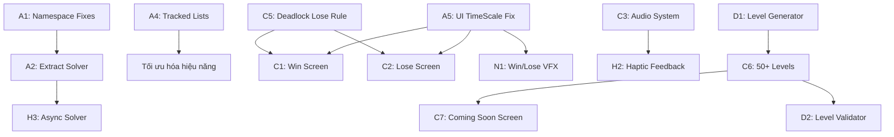

# Lộ trình Sản xuất Cuối cùng (Final Production Roadmap) — NumStrata

Bản lộ trình này được xây dựng dựa trên danh sách các tính năng và cải tiến kiến trúc đã được xác nhận ở Giai đoạn 3. Lộ trình được chia làm 4 Sprint phát triển song song với quá trình kiểm thử QA liên tục, đảm bảo trò chơi sẵn sàng cho phát hành chính thức.

---

## 1. Sơ đồ phụ thuộc giữa các tác vụ (Dependency Graph)

---

## 2. Kế hoạch Phân chia Sprint (Sprint Planning)

### Sprint 1: Tái cấu trúc Kiến trúc & Sửa lỗi Cốt lõi (Thời gian dự kiến: 1 tuần)
*Mục tiêu: Dọn dẹp codebase, tối ưu hiệu năng nền tảng và chuẩn bị các hệ thống cơ sở.*

| Mã số | Tên Tác vụ | Độ phức tạp | Mô tả chi tiết |
|---|---|---|---|
| **A1** | Namespace hóa toàn bộ script | Thấp | Đưa [MainMenuTabManager.cs](file:///c:/Project%20Unity/NumStrata/Assets/_Game/Scripts/UI/MainMenuTabManager.cs), [UISwitchManager.cs](file:///c:/Project%20Unity/NumStrata/Assets/_Game/Scripts/UI/UISwitchManager.cs), [TextSizeUniformizer.cs](file:///c:/Project%20Unity/NumStrata/Assets/_Game/Scripts/UI/TextSizeUniformizer.cs), [DebugGoldButton.cs](file:///c:/Project%20Unity/NumStrata/Assets/_Game/Scripts/Data/DebugGoldButton.cs) vào namespace `NumStrata.UI` và `NumStrata.Data` |
| **A2** | Tách bộ Solver khỏi LevelLoader | Trung bình | Tạo `LevelSolver.cs` riêng biệt, giảm kích thước và trách nhiệm của god class `LevelLoader`. |
| **A5** | Sửa lỗi `Time.timeScale` đóng băng UI | Thấp | Cập nhật [UIEffectManager.cs](file:///c:/Project%20Unity/NumStrata/Assets/_Game/Scripts/Utils/UIEffectManager.cs) để sử dụng `Time.unscaledDeltaTime` hoặc `Time.unscaledTime`, giúp các hiệu ứng UI vẫn chạy khi game pause. |
| **A6** | Dọn dẹp scene cũ | Thấp | Xóa `SampleScene.unity` và `MainMenuOld.unity` khỏi dự án. |
| **A7** | Khởi tạo lại cờ chế độ chơi khi khởi động | Thấp | Reset `IsChallengeMode` trong PlayerPrefs ở scene Boot để tránh lỗi tải sai tài nguyên sau crash. |
| **A4** | Sử dụng danh sách theo dõi thay cho `FindObjects` | Trung bình | Thay thế `FindObjectsOfType<Tile>()` và `FindObjectOfType<LevelLoader>()` bằng việc tự đăng ký/hủy đăng ký trong `Awake/OnDestroy`. |
| **A3** | Hợp nhất BoardLayerSystem và LevelLoader | Trung bình | Loại bỏ trùng lặp logic sinh board bằng cách chuyển hoàn toàn trách nhiệm cho một hệ thống duy nhất. |

---

### Sprint 2: Hoàn thiện Logic Gameplay & Giao diện Chính (Thời gian dự kiến: 1.5 tuần)
*Mục tiêu: Đảm bảo luồng chơi cốt lõi không còn lỗi và người chơi có phản hồi trực quan đầy đủ.*

| Mã số | Tên Tác vụ | Độ phức tạp | Mô tả chi tiết |
|---|---|---|---|
| **C5** | Thuật toán Phát hiện Kẹt nước đi (Deadlock) | Cao | Triển khai phân tích thế cờ thực tế (quét mọi ô số khả dụng kết hợp với các phép toán đang mở) để kiểm tra xem còn nước đi hợp lệ nào không. Thay thế quy tắc tạm thời `remainingTiles < 4`. |
| **C1** | Màn hình Thắng (Win Screen) | Trung bình | Tạo popup UI hiển thị khi vượt màn thành công, cộng vàng, nút đi tiếp "Next Level". |
| **C2** | Màn hình Thua (Lose Screen) | Trung bình | Tạo popup UI hiển thị khi thua cuộc, nút "Chơi lại", "Về trang chủ", và nút tích hợp Khiên. |
| **H3** | Giải thuật màn chơi Bất đồng bộ | Trung bình | Chuyển `TrySolveSpawnAndWinningPlan` sang chạy bất đồng bộ bằng Coroutine hoặc `async/await` kết hợp hiện vòng tròn chờ (loading wheel) để tránh gây nghẽn main thread gây crash ANR. |
| **C4** | Màn hình Chờ (Loading Screen) | Thấp | Xây dựng hiệu ứng chuyển cảnh mượt mà có thanh tiến trình giữa MainMenu ↔ Gameplay. |
| **C8** | Bảo mật Debug Tool | Thấp | Đưa bảng debug của `DebugGoldButton` vào cờ `#if UNITY_EDITOR || DEVELOPMENT_BUILD`. |

---

### Sprint 3: Tích hợp Hệ thống Hỗ trợ, Âm thanh & Sự kiện (Thời gian dự kiến: 1.5 tuần)
*Mục tiêu: Tăng trải nghiệm giác quan của người chơi và hoàn thiện vòng lặp kinh tế của game.*

| Mã số | Tên Tác vụ | Độ phức tạp | Mô tả chi tiết |
|---|---|---|---|
| **C3** | Hệ thống Âm thanh (Audio System) | Trung bình | Xây dựng `SoundManager` điều khiển bật/tắt âm lượng. Tích hợp nhạc nền (BGM) và hiệu ứng âm thanh (SFX) cho chạm ô, trộn ô, ghép đúng/sai, thắng, thua. |
| **H1** | Hệ thống Hướng dẫn (Tutorial) | Cao | Thiết kế hướng dẫn từng bước (từng lượt click tay chỉ) ở màn 1-3 cho người chơi mới hiểu luật chơi cơ bản. |
| **H5** | Tích hợp Khiên cứu mạng | Thấp | Khi người chơi bị xử thua, nếu có Khiên, game sẽ tự động trừ khiên và cho phép tiếp tục chơi (hoặc khôi phục trạng thái gần nhất) thay vì Game Over ngay. |
| **H6** | Thiết kế Vòng lặp Vàng | Thấp | Cho phép dùng vàng để mua lượt trợ giúp (hint, shuffle) hoặc đổi màu da ô số (cosmetics). |
| **H7** | Logic Reset Chuỗi thắng hàng tuần | Thấp | Viết hàm kiểm tra mốc thời gian để reset `completedDays` của tuần khi bước sang tuần mới. |
| **H4** | Chế độ Thử thách hàng ngày | Trung bình | Triển khai xoay vòng hoặc tải ngẫu nhiên các level khác nhau từ file cấu hình dựa trên ngày hiện tại, không sử dụng level cố định `campaign_0001`. |

---

### Sprint 4: Đánh bóng, Đa ngôn ngữ & Xuất bản (Thời gian dự kiến: 1 tuần)
*Mục tiêu: Đánh bóng đồ họa, hỗ trợ nhiều thiết bị và chuẩn bị cấu hình tốt nhất cho việc xuất bản Store.*

| Mã số | Tên Tác vụ | Độ phức tạp | Mô tả chi tiết |
|---|---|---|---|
| **N1** | Hoạt ảnh & Hiệu ứng hạt (VFX) | Trung bình | Tạo hiệu ứng hạt nổ lấp lánh khi ghép công thức thành công, hoạt ảnh ăn mừng thắng màn chơi. |
| **N3** | Firebase Analytics | Thấp | Tích hợp SDK Firebase Analytics và bắn các sự kiện như: `level_start`, `level_complete`, `level_fail`, `use_helper`. |
| **N6** | Đa ngôn ngữ (Localization) | Trung bình | Đưa toàn bộ các dòng chữ hiển thị (tiếng Việt, tiếng Anh) ra các file cấu hình ngoài (như JSON hoặc csv) để dễ dàng chuyển đổi ngôn ngữ. |
| **N7** | Viết Unit Tests cốt lõi | Trung bình | Triển khai các unit test kiểm thử độc lập cho `FormulaEvaluator` và parser phương trình. |
| **N8** | Object Pooling cho UI | Thấp | Tối ưu hóa bộ nhớ bảng xếp hạng và các ô số sinh ra liên tục bằng cơ chế gom đối tượng tái sử dụng. |
| **C6** | Thiết kế 50+ Level Chiến dịch | Cao | Thiết kế và xuất bản tối thiểu 50 file JSON màn chơi đầy đủ, tăng độ khó dần. |
| **C7** | Màn hình "Coming Soon" | Thấp | Hiện bảng thông báo thân thiện khi người chơi đã vượt hết các level khả dụng của bản build hiện tại. |
| **D3** | Cấu hình Đóng gói (Build Settings) | Thấp | Cấu hình các gói build khác nhau cho Android (.aab) và iOS, đảm bảo tối ưu hóa dung lượng và tắt các cờ debug. |

---

## 3. Kế hoạch Đảm bảo Chất lượng (QA Plan)

### 3.1 Kiểm thử Tự động (Automated Testing)
1. **Unit Tests**: Chạy trên Unity Test Runner để kiểm tra:
   - Các trường hợp tính toán của `FormulaEvaluator` (bao gồm cả các số âm và phép chia lẻ).
   - Kiểm tra định dạng cấu trúc file level JSON khi tải vào game.
2. **Backtracking Solver Validation**: Chạy thử bộ Solver trên editor để kiểm tra tính giải được của 50+ level mới tạo trước khi đóng gói.

### 3.2 Kiểm thử Thủ công (Manual Verification)
1. **UI/UX Responsive**: Test thử nghiệm trên các tỷ lệ màn hình khác nhau (16:9, 18:9, 19.5:9 tai thỏ, iPad 4:3) để đảm bảo không bị tràn chữ hoặc kẹt nút bấm.
2. **Trải nghiệm mạng yếu**: Giả lập mạng chập chờn để kiểm tra xem Cloud Sync có hoạt động mượt mà và không gây mất file save cục bộ hay không.
3. **Kiểm tra rò rỉ bộ nhớ (Memory Leak)**: Chạy thử game liên tục trong 1 tiếng và kiểm tra thông qua công cụ Unity Profiler để phát hiện các texture hoặc RAM bị phình to bất thường (đặc biệt là bảng xếp hạng).
